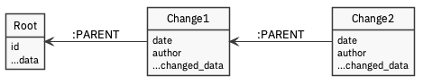

# change tracked data storage

Users need to be able to be informed of changes to their information in the system. This is commonly acheived using [event sourcing](https://martinfowler.com/eaaDev/EventSourcing.html), whereby the database stores a series of changes. The state of an object is then determined by applying all changes in the order they were created.

We have chosen a graph database \(Neo4j\) as our primary data storage platform. This lends itself to modelling changes as a 'git-like' series of changes which can be queried to retrieve the current record state.



This should be constrained so that there is only a single change path \(i.e. each node is a parent to only one change, and each change has only one parent\).

Given this model every update is a create, and it would be possible to restrict operations that can be performed.

## Queries

### Create bare root

The following style of Cypher would be used to create a new root:

```text
CREATE (root:TypeLabel { id: '123' })
RETURN root;
```

### Create changes

The first change could be applied to the root as follows:

```text
MATCH (root:TypeLabel) WHERE root.id = '123'
CREATE (root)<-[:PARENT]-(change:Change)
SET change += change_properties
RETURN change;
```

This won't work for subsequent additions, as we need to append to the chain. The following Cypher selects the end of the chain or the root if no chain exists. The queries either side of the UNION are a disjoint, so shoud only return a single item the root or the latest change.

```text
MATCH (root:TypeLabel) WHERE root.id='123'
CALL {
  WITH root
  WITH root WHERE size((root)<-[:PARENT*]-()) < 1
  RETURN root as parent

  UNION

  WITH root
  MATCH path=(root)<-[:PARENT*]-(change:Change)
  WITH path, change
  ORDER BY length(path) DESC LIMIT 1
  RETURN change AS parent
}
RETURN parent;
```

Combining these two queries gives the following generalised update pattern

```text
MATCH (root:TypeLabel) WHERE root.id = '123'
CALL {
  WITH root
  WITH root WHERE size((root)<-[:PARENT*]-()) < 1
  RETURN root as parent

  UNION

  WITH root
  MATCH path=(root)<-[:PARENT*]-(change:Change)
  WITH path, change
  ORDER BY length(path) DESC LIMIT 1
  RETURN change AS parent
}
CREATE (parent)<-[:PARENT]-(change:Change)
SET change += change_properties
RETURN change;
```

### Collapse all edits

Simplistically, iterating over all the changes will provide a consolidated view of the latest state of the entity. NB This will not remove properties.

```text
MATCH (root:TypeLabel) WHERE root.id='123'
MATCH path=(root)<-[:PARENT*]-(change:TypeLabel:Change)
WITH root, path
ORDER BY length(path) DESC LIMIT 1
RETURN reduce(
  acc=properties(root),
  n IN nodes(p) | apoc.map.merge(acc, n)
) as result  
RETURN result;
```

The following query will return either the root or the combined root + changes if they exist. There is a disjoint between the first and second clauses, so the subquery should only return one element. 

```text
MATCH (root:TypeLabel) WHERE root.id='123'
CALL {
  WITH root
  WITH root WHERE size((root)<-[:PARENT*]-()) < 1
  RETURN properties(root) as result

  UNION

  WITH root
  MATCH path=(root)<-[:PARENT*]-(change:Change)
  WITH root, path
  ORDER BY length(path) DESC LIMIT 1
  RETURN reduce(
  	acc=properties(root),
    n IN nodes(path) | apoc.map.merge(acc, n)
  ) as result
}
RETURN result;
```

## Outstanding items to research

* Performance of long chains / indexing
* How to handle updates. Should we update the root when adding change? Is this a batch job, or asynchronously handled?
* How about querying on current state of entry in changeset. Could be problematic.
* Hashing contents of properties to ensure non-repudiation
* Constraints on numbers of parents, number of changes that can lead from a given root or change. 
* Tracking changes to relationships.


