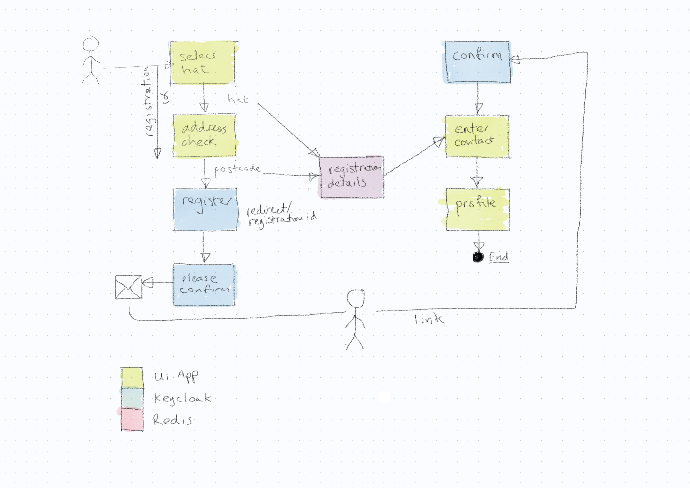

# sign-up

Notes:

* All ui screens are in the sign-up module
* Need some kind of authenticated session in the UI to store registration details
* Keycloak must pass the session token back as part of the login session

