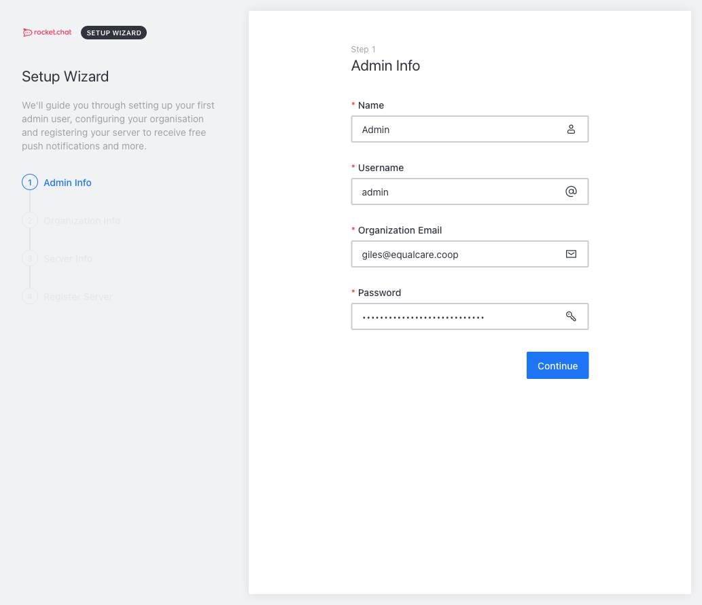
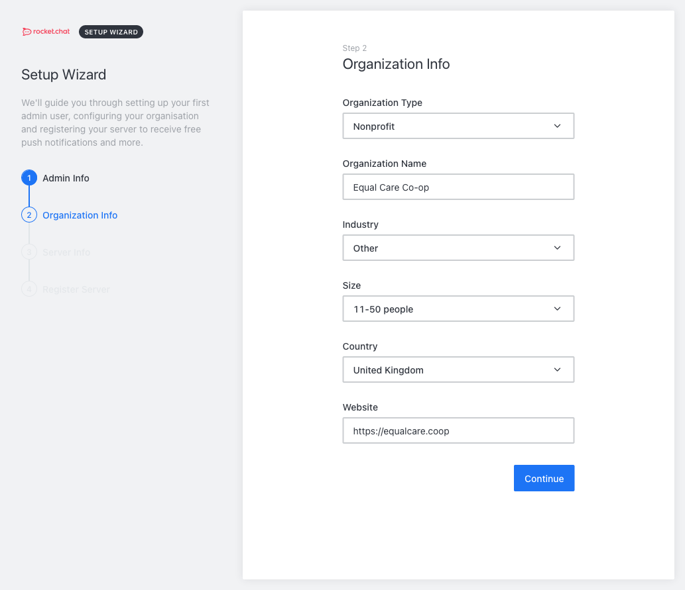
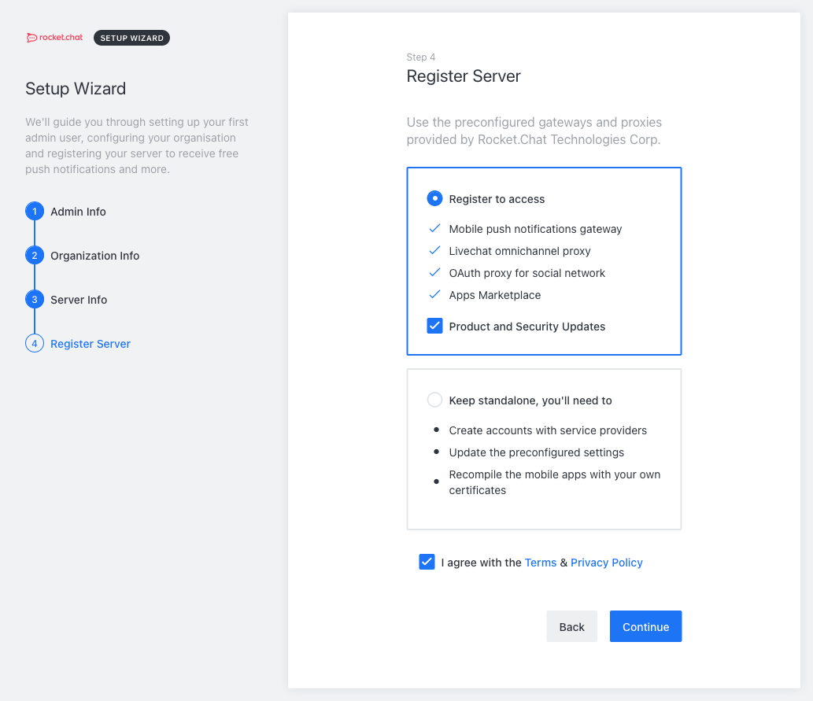

# rocket chat

## Initial setup

The following screens need to be set up for a new install








## Settings

The following settings need to be made within Rocket Chat. These will have to be done manually, as there seems no way to automate configuration.

### Connectivity Services

Log in to the Rocket.Chat cloud with the Equal Care account.

### Apps

Install the GIPHY app

### Permissions

To be defined, but at least the following:

* Enable **Bypass rate limit for REST API** for the user role.
* Disable all users and groups from **Create Invite Links.**

### Accounts

* Forget User Session on Window Close - set to true

#### Iframe

* Set to enabled
* Iframe URL - https://&lt;platform url&gt;/messages/sso
* API URL - https://&lt;platform url&gt;/messages/sso
* API Method - POST

### General

* Set site URL
* Set site name
* Disable **Restrict access inside any Iframe**.

#### Iframe integration

* Enable Send - set to true
* Set send target origin to \*
* Enable Receive - set to true
* Set receive target origin to \*

NB This should probably be tightened up

### Layout

#### Custom CSS

Can be found in [this repo](https://gitlab.com/eccoo-platform/common/rocketchat-css).

### Message

#### Katex

* Katex disabled

### OAuth

Create a new Custom OAuth Provider with the folliowing settings:

| Setting | Value |
| :--- | :--- |
| Name | Keycloak |
| URL | https://&lt;keycloak url&gt;/auth |
| Token Path | /realms/equal-care/protocol/openid-connect/token |
| Token Sent Via | Header |
| Identity Token Sent Via | Same as "Token Sent Via" |
| Identity Path | /realms/equal-care/protocol/openid-connect/userinfo |
| Authorize Path | /realms/equal-care/protocol/openid-connect/auth |
| Scope | openid profile roles |
| Param Name for access\_token | access\_token |
| Id | web |
| Secret | &lt;OAuth secret&gt; |
| Login style | Redirect |
| Key Field | Email |
| Email field | email |
| Name field | nickname |
| Avatar field | picture |
| Roles/Groups field name | roles |
| Roles/Groups field for channel mapping | groups |
| Merge Roles from SSO | ENABLED |

Set the following OAuth Group Channel Map

```javascript
{
	"rocket-admin": "admin",
	"tech-support": "support"
}
```

## User configuration

To Document passing roles from keycloak and mapping to 

## Notification Channels

We need to set up some standard channels that act as notification hubs:

`notify-hat-requests`

For each of these newly created channels, invite Discobot. Then configure the relevant environment variable to point to the channel name.

