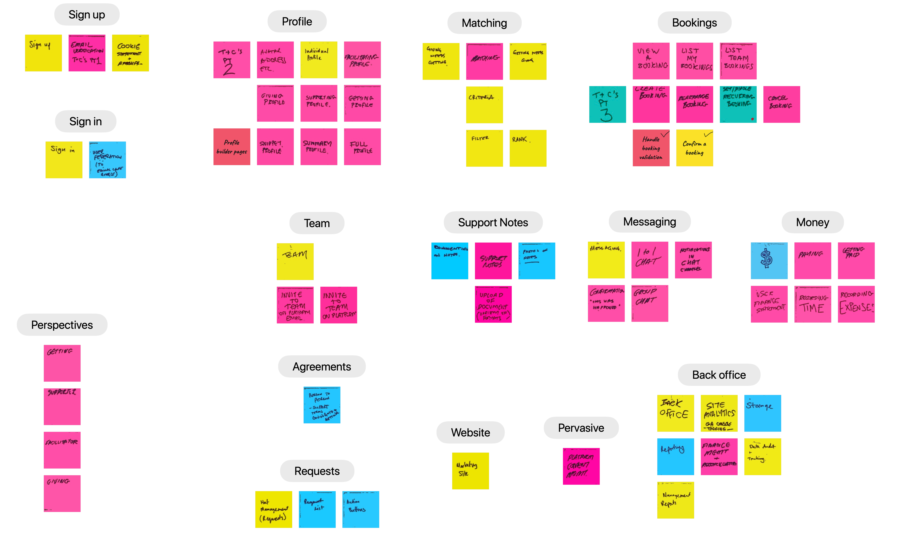

# feature roadmap

We need to deliver a series of features to complete the MVP. This is an attempt to lay out the critical features as a roadmap. There is a significant linkage between this and the various Asana boards that we are using to manage the work.

## Eccoo features

### Sign up

* Sign up
* Email Verification Ts & Cs PT1
* Cookie Statement + Agreement

### Profile

* T’s and C's Part 2
* Avatar, Address, etc
* Individual Profile
* Facilitator Profile
* Giving Support Profile
* Arranging Support Profile
* Getting Support Profile
* Profile builder pages
* Snippet view of profile
* Summary view of profile
* Full view of profile

### Matching

* Giving Support WLTM Getting Support
* Matching
* Getting Support WLTM Giving Support
* Criteria
* Filter
* Rank

### Bookings

* View a booking
* List my bookings
* List team bookings
* T’s & C ’s Pt 3
* Create booking
* Rearrange booking
* Set / Disable Recurring Booking
* Cancel Booking
* Handle booking validation
* Confirm a booking

### Sign in

* Sign in
* User federation \(to Equal Care GSuite\)

### Team

* Team
* Invite to team off platform email
* Invite to team on platform

### Support Notes

* Comments on notes
* Support notes
* Photo of Notes
* Upload of Document \(Variety of Formats\)

### Messaging

* Messaging
* 1 to 1 chat
* Notification in chat channel
* Confirmation “this has happened”
* Group Chat

### Money

* $
* Paying
* Getting paid
* Issue finance statement
* Recording time
* Recording expenses

### Perspectives

* Getting Support
* Arranging Support
* Facilitator
* Giving Support

### Agreements

* Person to Person - support terms giving &lt;-&gt; getting

### Website

* Marketing Site

### Pervasive

* Platform Content Management

### Back office

* Back Office
* Site Analytics

  GA Console / Tagging

* Storage
* Reporting
* Finance Management and reconciliation
* Data Audit and Tracking
* Management Reports

### Requests

* Hat Management \(Requests\)
* Request list
* Action Buttons

## References

This data was derived from a brainstorm captured in the 3m [Post It App](https://www.post-it.com/3M/en_US/post-it/ideas/app/).

