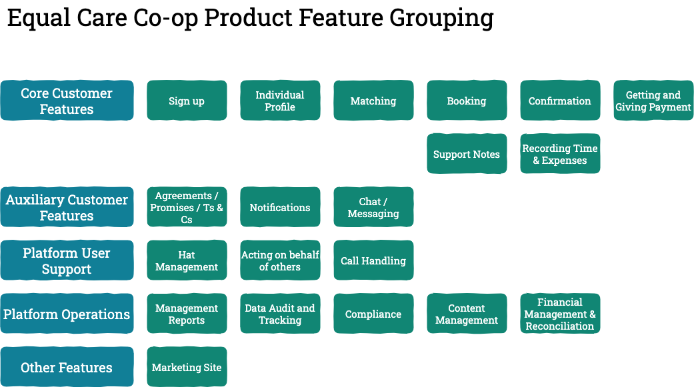

# feature roadmap

We need to deliver a series of features to complete the MVP. This is an attempt to lay out the critical features as a roadmap. There is a significant linkage between this and the various Asana boards that we are using to manage the work.

The groupings down the left-hand side are mainly to help ensure that we've covered all required areas.

* Core Customer Features covers the functionality at the heart of the platform. It's laid out as a sequential flow as experienced by the users, although this probably won't reflect roadmap ordering
* Auxiliary Customer Features covers other required functions which surround the code features
* Platform User Support contains features that enable the platform users to be supported in using the platform by others \(facilitators or other Equal Care Co-op staff\)
* Platform Operations contain 'back office' features that the platform must support to ensure that the co-operative can continue to operate
* Other Features is a general bag of other things that will be required for MVP but which don't have a natural home

