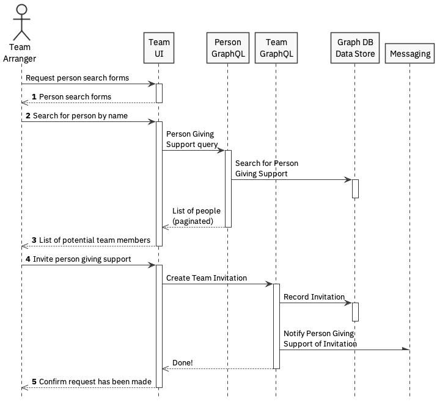
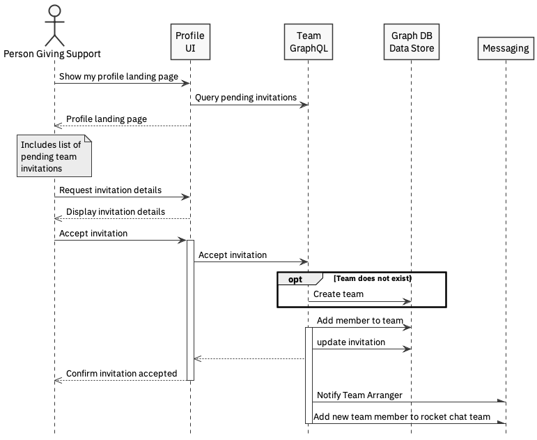

# team management

## Business needs

Equal Care Facilitators are taking a large amount of time managing teams in the current tactical platform. By providing the ability to form and expand teams within the platform, this removes some of the burden from facilitators.

## Overview

There are three parts to team formation:

* Creating a team when the person getting support \(or the person acting on their behalf\) invites the first person giving support
* Extending a team by inviting additional team members
* Joining an existing team by requesting access

In each case, this is a two-part activity, either invite-accept \(initiated by the person getting support\), or request-approve \(initiated by the person giving support\).

1. The system **must** present lists of pending invitations and requests to all relevant parties, enabling acceptance / approval as appropriate.
2. 3. The system **should** notify the all parties via direct message of changes in state.
4. The system **should** keep Rocket Chat team membership aligned to the confirmed team members.

### Assumptions

1. No time limitations on request
2. The system **will** only allow a person getting support or their advocate \(albeit that in reality this is being 'faked' by current users given lack of a specific arranging support hat\) to approve requests.
3. The system **will** only allow a person giving support to accept their own invitations.

## Use cases


The use cases below assume that invitations/requests are either accepted/approved or ignored. The sunny-day scenario is the only one presented. Logically, there may also be alternative scenarios which enable declined/rejected outcomes.


### &lt;SOMEONE&gt; approves a hat request

#### Preconditions

* A hat request exists in the system
* A profile has been 'completed' \(for some definition of complete - TBD\) for the person requesting the hat
* Someone has a suitable level of permissions to grant hat requests within the system

#### Steps

1. The system presents a \(filtered???\) list of pending hat requests
2. &lt;SOMEONE&gt; selects one of them
3. The System presents the appropriate profile for the hat request
4. &lt;SOMEONE&gt; approves the hat request
5. The system notifies &lt;SOMEONE&gt; that the hat request has been approved

#### Postconditions

* The hat request has been granted
* The system allocates the hat to the person
* The person requesting the hat is notified of the hat grant

### Team arranger adds a new person giving support to the team

Team arranger is the team owner \(person getting support\) or the person arranging support on their behalf.

#### Preconditions

* All relevant people registered in system.
* Team may or may not yet exist.
* All relevant hats requests have been granted.

#### Steps

1. System presents a search for user form
2. Team arranger searches for team member by name
3. System presents a list of matching platform users with a giving support hat, along with minimal contextual summary
4. Team arranger selects the team member and invites them to their team
5. System notifies team arranger of outcome of request

#### Postcondition

* System has created a record for team \(if one did not exist\)
* System has registered invitation for potential team member
* System \(potentially\) notifies potential team member via Rocket Chat.

### Person giving support accepts invitation to team

#### Preconditions

* An invitation has been sent

#### Steps

1. System presents list of pending invitations
2. User selects invitation from list of invites
3. System presents details of the invitation including team summary
4. User accepts the invitation
5. System notifies person giving support of outcome

#### Postconditions

* Person Giving Support is added to the team
* Team members can see one another's profiles on the team page
* Team Arranger is notified that invitation has been accepted

### Person giving support requests access to join an existing team

#### Preconditions

* A team exists
* Person Giving Support has been granted hat

#### Steps

1. System presents a search form for teams
2. Person Giving Support searches for a team by team owner name
3. System presents a list of matching teams
4. Person Giving Support selects the team they wish to join
5. System confirms that the request has been made

#### Postconditions

* System has created a record of the request to join a team
* The team owner / arranger has been notified of the request

### Team arranger approves request to join a team

#### Preconditions

* A request has been made to join a team

#### Steps

1. System presents a list of requests to join their team
2. Team Arranger selects a request for detailed review
3. System displays the summary details of the request, including information about the Person Giving Support
4. Team Arranger approves the request
5. System confirms that the request has been approved

#### Postconditions

* System has added the Person Giving Support to the team
* Person Giving Support has been notified of the outcome of their request

## Sequence Diagrams

### Invite new team member

### Accept team invitation

## Implementation notes

Should make use of events for notifications and other asynchronous activities \(such as adding users to a team\). See [https://docs.nestjs.com/techniques/events](https://docs.nestjs.com/techniques/events) for details. Propose that the event is `notify.user`. Payload includes userid, message, link.

We might also want to consider the backend application employing a CQRS pattern. See [https://docs.nestjs.com/recipes/cqrs](https://docs.nestjs.com/recipes/cqrs) for more info.

