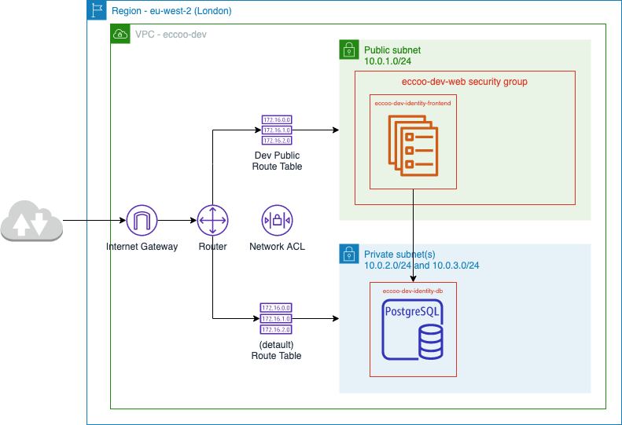

# cloud configuration

Amazon Web Services provides the ability to set up Virtual Private Cloud which are in essence private data centres.

We will ultimately need to create a number of VPCs for different purposes. The first of these is the Development VPC.

## Development VPC

The diagram below shows the Development VPC

