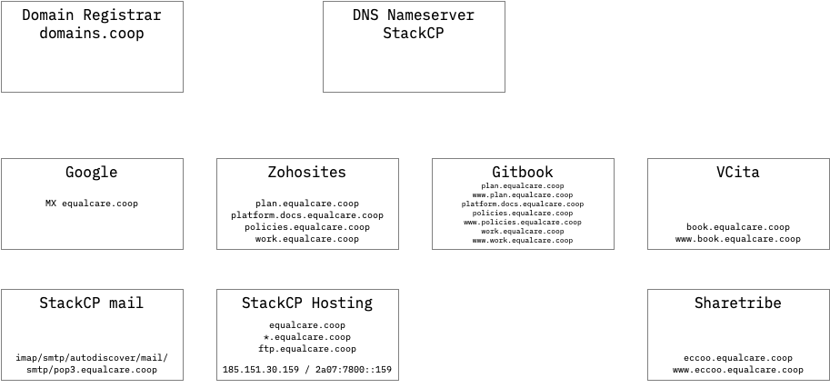

# domain name service

## Current domain setup



## Future domain mapping

| Domain | Service | Comments |
| :--- | :--- | :--- |
| equalcare.coop |  |  |
| www.equalcare.coop | zhs.zohosites.eu | Main website |
| equalcare.coop | \(Multiple\) | Google setup |
| mail.equalcare.coop, calendar.equalcare.coop | ghs.googlehosted.com | Google service overrides. See [https://support.google.com/a/answer/53340](https://support.google.com/a/answer/53340) |
| book.equalcare.coop, www.book.equalcare.coop | connect.vcita.com |  |
| plan.equalcare.coop, platform.docs.equalcare.coop, policies.equalcare.coop, work.equalcare.coop, www.plan.equalcare.coop, www.policies.equalcare.coop, www.work.equalcare.coop | hosting.gitbook.com | Git book documentation. Should some/all of these really sit under the docs subdomain? |

## Records

### nameservers

```text
❯ dig +short NS equalcare.coop
ns3.stackdns.com.
ns1.stackdns.com.
ns4.stackdns.com.
ns2.stackdns.com.
```

### whois record

```text
% IANA WHOIS server
% for more information on IANA, visit http://www.iana.org
% This query returned 1 object

refer:        whois.nic.coop

domain:       COOP

organisation: DotCooperation LLC
address:      1775 Eye Street, NW
address:      8th Floor
address:      Washington DC 20006
address:      United States

contact:      administrative
name:         Violetta Nafpaktiti
organisation: DotCooperation LLC
address:      1775 Eye Street, NW
address:      8th Floor
address:      Washington DC 20006
address:      United States
phone:        +1 202 383 5453
fax-no:       +1 202 628 6726
e-mail:       violetta@identity.coop

contact:      technical
name:         CTO
organisation: CentralNic
address:      Saddlers House, 4th Floor
address:      44 Gutter Lane
address:      London EC2V 6BR
address:      United Kingdom
phone:        +44 2033880600
fax-no:       +44 2033880601
e-mail:       ops@centralnic.com

nserver:      A.NIC.COOP 194.169.218.64 2001:67c:13cc:0:0:0:1:64
nserver:      B.NIC.COOP 185.24.64.64 2a04:2b00:13cc:0:0:0:1:64
nserver:      C.NIC.COOP 212.18.248.64 2a04:2b00:13ee:0:0:0:0:64
nserver:      D.NIC.COOP 212.18.249.64 2a04:2b00:13ff:0:0:0:0:64
ds-rdata:     9961 8 1 F9370FAEAF0B8464B7C8802136A03FC96D8FF200
ds-rdata:     9961 8 2 7464849B6C08384030D135D156559691DB98804CE1DAB9891447CA45B594EF36

whois:        whois.nic.coop

status:       ACTIVE
remarks:      Registration information: http://www.nic.coop

created:      2001-12-15
changed:      2020-03-19
source:       IANA

# whois.nic.coop

Domain Name: EQUALCARE.COOP
Registry Domain ID: D58203048-CNIC
Registrar WHOIS Server: whois.domains.coop
Registrar URL: http://www.domains.coop/
Updated Date: 2020-01-10T14:48:52.0Z
Creation Date: 2017-12-18T22:37:36.0Z
Registry Expiry Date: 2020-12-18T23:59:59.0Z
Registrar: Domains.COOP
Registrar IANA ID: 465
Domain Status: ok https://icann.org/epp#ok
Registrant Organization: Equal Care Co-op
Registrant State/Province: Yorkshire
Registrant Country: GB
Registrant Email: Please query the RDDS service of the Registrar of Record identified in this output for information on how to contact the Registrant, Admin, or Tech contact of the queried domain name.
Admin Email: Please query the RDDS service of the Registrar of Record identified in this output for information on how to contact the Registrant, Admin, or Tech contact of the queried domain name.
Tech Email: Please query the RDDS service of the Registrar of Record identified in this output for information on how to contact the Registrant, Admin, or Tech contact of the queried domain name.
Name Server: NS1.STACKDNS.COM
Name Server: NS2.STACKDNS.COM
Name Server: NS3.STACKDNS.COM
Name Server: NS4.STACKDNS.COM
DNSSEC: unsigned
Billing Email: Please query the RDDS service of the Registrar of Record identified in this output for information on how to contact the Registrant, Admin, or Tech contact of the queried domain name.
Registrar Abuse Contact Email: violetta@domains.coop
Registrar Abuse Contact Phone: +44.1865403136
URL of the ICANN Whois Inaccuracy Complaint Form: https://www.icann.org/wicf/
>>> Last update of WHOIS database: 2020-03-25T13:23:04.0Z <<<

# whois.domains.coop

Domain Name: equalcare.coop
Registry Domain ID: D58203048-CNIC
Registrar WHOIS Server: whois.domains.coop
Registrar URL: http://www.domains.coop/
Updated Date: 2019-11-25T05:00:35Z
Creation Date: 2017-12-18T22:37:36Z
Registrar Registration Expiration Date: 2020-12-18T23:59:59Z
Registrar: CentralNic Coop
Registrar IANA ID: 465
Reseller: Domains.coop
Domain Status: ok http://www.icann.org/epp#ok
Registry Registrant ID: REDACTED FOR PRIVACY
Registrant Name: REDACTED FOR PRIVACY
Registrant Organization: REDACTED FOR PRIVACY
Registrant Street: REDACTED FOR PRIVACY
Registrant City: REDACTED FOR PRIVACY
Registrant State/Province: Yorkshire
Registrant Postal Code: REDACTED FOR PRIVACY
Registrant Country: GB
Registrant Phone: REDACTED FOR PRIVACY
Registrant Phone Ext: REDACTED FOR PRIVACY
Registrant Fax: REDACTED FOR PRIVACY
Registrant Fax Ext: REDACTED FOR PRIVACY
Registrant Email: https://mydomainprovider.com/contact_domain/
Registry Admin ID: REDACTED FOR PRIVACY
Admin Name: REDACTED FOR PRIVACY
Admin Organization: REDACTED FOR PRIVACY
Admin Street: REDACTED FOR PRIVACY
Admin City: REDACTED FOR PRIVACY
Admin State/Province: REDACTED FOR PRIVACY
Admin Postal Code: REDACTED FOR PRIVACY
Admin Country: REDACTED FOR PRIVACY
Admin Phone: REDACTED FOR PRIVACY
Admin Phone Ext: REDACTED FOR PRIVACY
Admin Fax: REDACTED FOR PRIVACY
Admin Fax Ext: REDACTED FOR PRIVACY
Admin Email: https://mydomainprovider.com/contact_domain/
Registry Tech ID: REDACTED FOR PRIVACY
Tech Name: REDACTED FOR PRIVACY
Tech Organization: REDACTED FOR PRIVACY
Tech Street: REDACTED FOR PRIVACY
Tech City: REDACTED FOR PRIVACY
Tech State/Province: REDACTED FOR PRIVACY
Tech Postal Code: REDACTED FOR PRIVACY
Tech Country: REDACTED FOR PRIVACY
Tech Phone: REDACTED FOR PRIVACY
Tech Phone Ext: REDACTED FOR PRIVACY
Tech Fax: REDACTED FOR PRIVACY
Tech Fax Ext: REDACTED FOR PRIVACY
Tech Email: https://mydomainprovider.com/contact_domain/
Name Server: ns1.stackdns.com
Name Server: ns2.stackdns.com
Name Server: ns3.stackdns.com
Name Server: ns4.stackdns.com
DNSSEC: not signed
Registrar Abuse Contact Email: violetta@domains.coop
Registrar Abuse Contact Phone: +44.1865403136
URL of the ICANN WHOIS Data Problem Reporting System:
http://wdprs.internic.net/
>>> Last update of WHOIS database: 2020-03-25T13:23:04Z <<<


```


