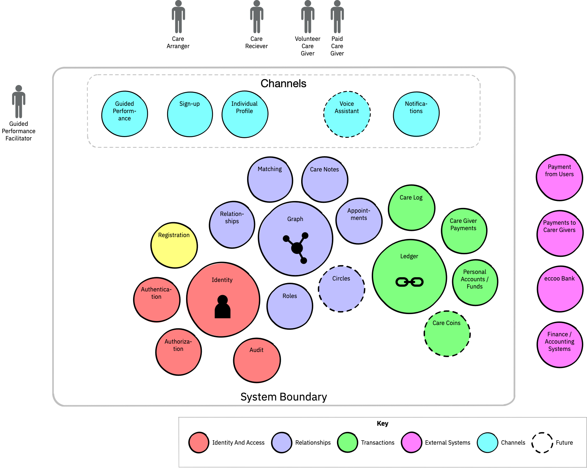

# architecture overview

The following diagram provides an at-a-glance view of the platform design. This is a work in progress, and will be updated as requirements are clearer, and roadmap steps come into scope. The current horizon for this design is the Platform MVP, which will drive the initial delivery. Each building block will be further broken down to identify responsibilities in the forms of interfaces, data and function.

## System Context \(a.k.a the outside the system boundary\)

The primary system roles, Care Receiver and Care Giver \(two variants: volunteer and paid\), are shown to the top of the diagram. A supporting role of Care Arranger may act on behalf of the Care Receiver. This could be a family or community member, or a care professional. The converse of this role: the facilitator offering guided performance, is an eccoo-provided role offering telephone-based \(?\) support to users.

System-to-system interactions already identified are:

* SMS Service
* Email Service
* eccoo bank

## System Narrative

The system comprises a series of interlocking subsystems, each with a defined purpose.

* The [identity and access subsystem](component-designs/identity-and-access-subsystem/) is responsible for controlling the security of the platform. The identity store enables people to be registered in the platform, and is used to underpin authentication and authorisation services. The related audit service records significant events within the system, such as who is accessing care records.
* The [relationships subsystem](component-designs/relationships-subsystem/) manages all caring relationships within the system, and 

At heart the platform marries a graph database which tracks relationships between people and groups \(such as circles\) with a ledger which manages the exchange of value between these people. As such, it can be thought of as a transaction-oriented social network.

* The [sign-up](component-designs/channels-subsystem/sign-up.md) component manages the initial process of creating a user identity \(managed by the [identity](component-designs/identity-and-access-subsystem/identity-component.md) component\). This identity has a role assigned in the [Role Manager](component-designs/identity-and-access-subsystem/role-manager.md).
* If signing up as a care received, matching can then take place to attempt to forge a link with a care giver. This is mediated by the [matching](component-designs/relationships-subsystem/matching-component.md) component which attempts to match based on the criteria held in the relative profiles \(assumed to be needs, skills and other criteria such as location and availability\).
* Once a match has been established, the relationship is stored in the [Relationship Graph](component-designs/relationships-subsystem/relationship-graph.md). This will, in conjunction with the role manager and [authorisation](component-designs/identity-and-access-subsystem/authorisation.md) component, enable fine-grained permissions over personal information managed in the system.
* The [Appointment Booking](component-designs/relationships-subsystem/appointment-booking.md) component is responsible for enabling users to arrange meetings. Initially this will be between care givers and care receivers, but ultimately the concepts could be reused to cover circle or interest group meetings.
* Some of these meetings will be to deliver care to care receivers: to facilitate payment, these will be tracked in the [Care Logging](component-designs/transactions-subsystem/care-logging.md) component. Care notes associated with these meetings will be logged in the [Care Notes](component-designs/relationships-subsystem/care-notes.md) component. This will be associated with the care receiver, and accessible to the care giver.
* \[Payment handling interactions are to be determined, but will be managed via the [payments](component-designs/transactions-subsystem/payments.md) component\]
* All components are likely to need to notify the users, which they will do via the [notification management](component-designs/channels-subsystem/notification-management.md) component. User contact preferences will also be managed here.
* The need for guided performance is recognised by the [guided performance](component-designs/channels-subsystem/guided-performance.md) component. This will allow the temporary performance of system actions on behalf of a user.

