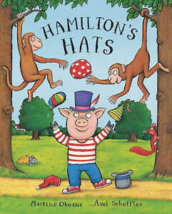

# identity

The individual profile component represents about the user within the platform.

## ​C​ritical requirements

* Encryption of personal data
* Provision of unique identifier - the Person ID \(PID\).

## ​Implementation

This may not be a viable component on its own, but may actually be a facet of the relationship component.

On the other hand, this might be the core user data \(e.g. name, gender, address\). If so, this should be a database of some kind. A SQL \(Relational\) Database could do this, as could a NoSQL Database. Selection of database technology should be based on other choices of database.

## Reference

### Roles or Hats

This concept allows for 'personalisation' of the core platform based on the role or roles that the individual is playing within Equal Care Co-op. Each person may, at times, wear multiple hats. The primacy of the individual profile means that each person is uniquely known to the platform, but can switch seamlessly between the hats. A hat is needed if the individual has different informational or process needs.

What that diagram says in English is:

> We have the concept of an **Individual** within the platform. This represents a platform user of any type. The type is defined by a **Role** that the individual has assigned. This is formally represented by an Aggregation relation \(line with a diamond at the end which Aggregates the other concept\). There are a number of roles that can be assigned: **Care Giver** and **Care Getter** are the two that are shown here. These are sub-types, represented by a Specialisation relation \(closed, white arrowhead pointing at the more general concept\).
>
> The Individual also aggregates a **Case File**, a set of **Permissions** and a **Skills Record**. The Case File is linked with \(Association relation - solid line, no arrowheads\) a Care Giver and a Care Getter. These associations are forged by:
>
> * **Case File Ownership** which is a kind of permission granted by role \(**Role-based permission**\). A Care Getter owns their own Case File, implying certain accesses\). The implication is that this ownership is implicit and inherent and cannot be revoked.
> * **Case File Access** which is a kind of permission explicitly granted \(**Granted permission**\) to a Care Giver to enable them to discharge their role. This implies that the permission can be revoked. The mechanism for granting and revoking \(and enforcing!\) permissions must be provided by the platform.

You can see why software engineers tend to draw a lot of pictures.

