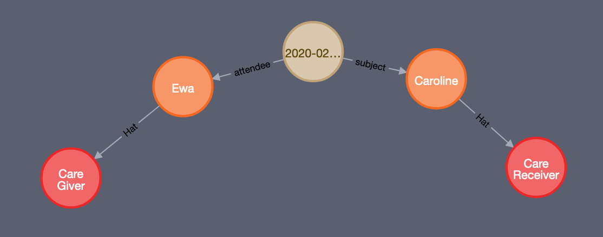

# appointments

Appointment booking is responsible for facilitating the booking and completion of appointments.

## Critical requirements

* Must be able to schedule one-off appointments
* Should be able to schedule repeating appointments
* Should send notification of appointment time
* Should send appointment reminders
* Must support appointment rearrangement
* Must support appointment cancellation

## Implementation

Appointments should be stored in the Graph linking to the attendees of the meeting \(care giver, care receiver, observer, etc\).

This will be implemented as an API layer on top of the graph database, in common with other components in this subsystem.

