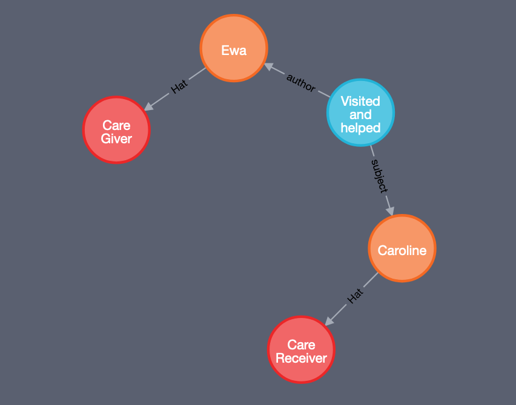

# care notes

The care notes component is responsible for tracking notes associated with a care receiver's care. Conceptually, it is a shared notebook with multiple entries created by and visible to the care receiver, care givers and other interested parties such as family members.

## Critical Requirements

* Must protect the sensitive personal data in the event of data breach - encryption
* Should be possible to limit the readership for individual entries

## Implementation

This should be implemented as a node in the graph database with the following structure.

```javascript
{
  "permissions": {},
  "datetime": "20200101T103002Z",
  "notes": "Care note content.",
}
```

* `permissions` is an object defining who can see and edit the note
* `timestamp` is an ISO 8901 formatted timestamp
* `notes` is a string containing the notes

The node should be linked with edges to the author and subject people.



The notes will need to be encrypted to prevent data leakage.

The API for the service will need to enable the following actions:

* Create note for person
* Limit readership
* Retreive note for person

