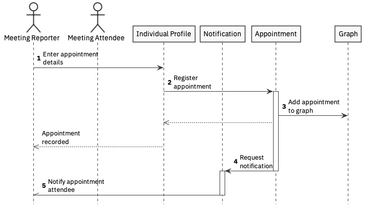

# appointment arranging

For the MVP, the appointment elements of the solution will be limited to recording that an appointment arrangement has been made. This can be recorded by either the care giver or care receiver.

Pre-requisites:

* A care relationship exists between the care receiver and care giver

1. The Meeting Reporter enters details about the appointment - time, date, attendees, location, etc
2. The Individual Profile forwards this to the Appointment service
3. The Appointment service adds the details to the graph, recording the attendees and then responds to the Meeting Reporter that the appointment has been recorded
4. The Appointment service asynchronously issues a notification request via the Notification service
5. All Appointment Attendees are notified of the time, date and location of the service \(potential via an [iCal](https://en.wikipedia.org/wiki/ICalendar) attachment\)

This notification pattern could also be used as the appointment approaches to remind the attendees of forthcoming appointments.

