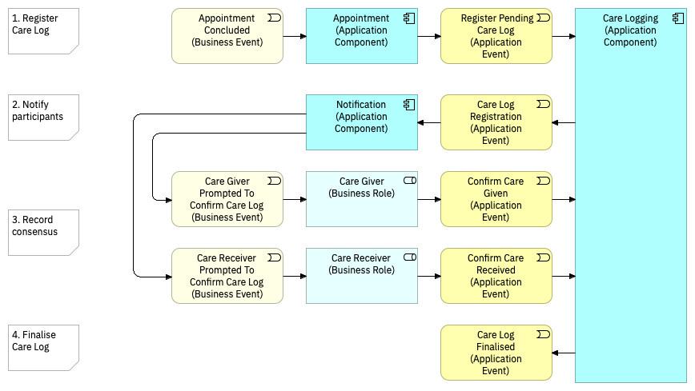

# care logging

The purpose of care logging is to track the care that has been given. As this represents the critical exchange of value enabled by the platform, consensus will be required between care giver and care receiver.

## Scenarios

### Agreement

In this 'sunny day' scenario, each system user will simply agree with the record defined by the appointment component.

1. Once the appointment time has completed, the appointment booking component sends a message which is intercepted by the care logging component. This creates a pending care log entry.
2. The care log interacts with the notification component to notify the care giver and care receiver \(or whoever was at the appointment\) that they need to confirm the details of the appointment. This will initially be the fact that it took place, but may be extended to cover duration and 'satisfaction' as the platform capabilities are developed.
3. The care giver and care receiver log their agreement with the recorded details.
4. Once consensus has been logged by all participants, the care log will store the entry on the ledger, and the care logging interaction ends.

