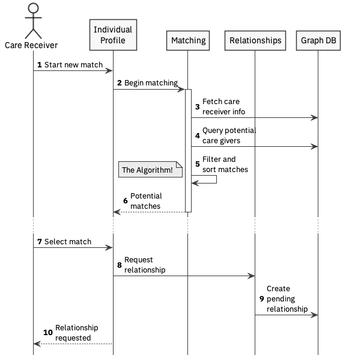

# matching

Preconditions:

* Care Receiver registered in system
* Care needs are captured - not clear how this will be done in the MVP.

## Scenarios

### Simple match

The simple match will cover selecting, filtering and sorting appropriate care givers from the graph. The filter criteria are to be determined during UX design.

1. Care receiver requests a new caring relationship
2. The Individual Profile component initiates a matching process, providing the user credentials and any criteria
3. The Matching component requests base person information from the graph based on credentials provided
4. The matching component performs one or more queries to retrieve potential care givers from the graph
5. Matching component assesses the potential matches, filtering and ordering according to 'The Algorithm'
6. Matching component presents the ordered set of matches to the individual profile
7. Having been presented with the list, the Care Receiver select the match they prefer
8. The Individual Profile component requests the relationship component to create the relationship.
9. This is created in a pending state in the graph
10. The user is notified that the relationship has been requested

The concept of a pending relationship is critical, as it provides agency to the care giver to accept or decline the match.

