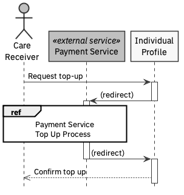
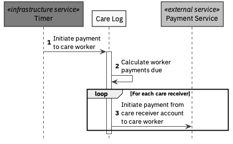

# payments

The following scenarios assume that an external Payment Service is being used to manage payments

## Scenario

### Care Receiver Account Top-up

### Care Worker Payment

Preconditions:

* Agreed care logs available in the system
* Sufficient funds in all care receiver accounts

