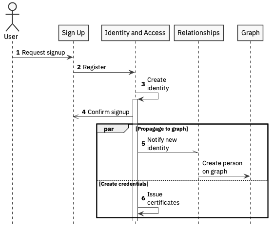

# user registration

This walkthrough deals with registration in the system and propagating the identity to the relevant components. Notably, the assignment of hats is not covered by this flow. It is suggested that anyone registering for the platform does so as a basic platform user with no specific hat. Their hat acquisition journeys can then commence from within the individual profile.

## Scenarios

### Registration

This flow shows how a user registers with the platform. This will likely be a variant of the selected identity and access components sign-on process.

1. The aspiring platform user requests sign up, providing minimal details \(name and email address\).
2. The sign-up component registers with the identify and access component
3. This creates an identity
4. Once this is done, the signup can be confirmed to the user.
5. The Identity and Access component notifies the relationships component that a new user has been created, causing a new person node to be registered on the graph tied to the provided identity.
6. At the same time \(in **par**allel\), the Identity and Access component creates the required credentials.

