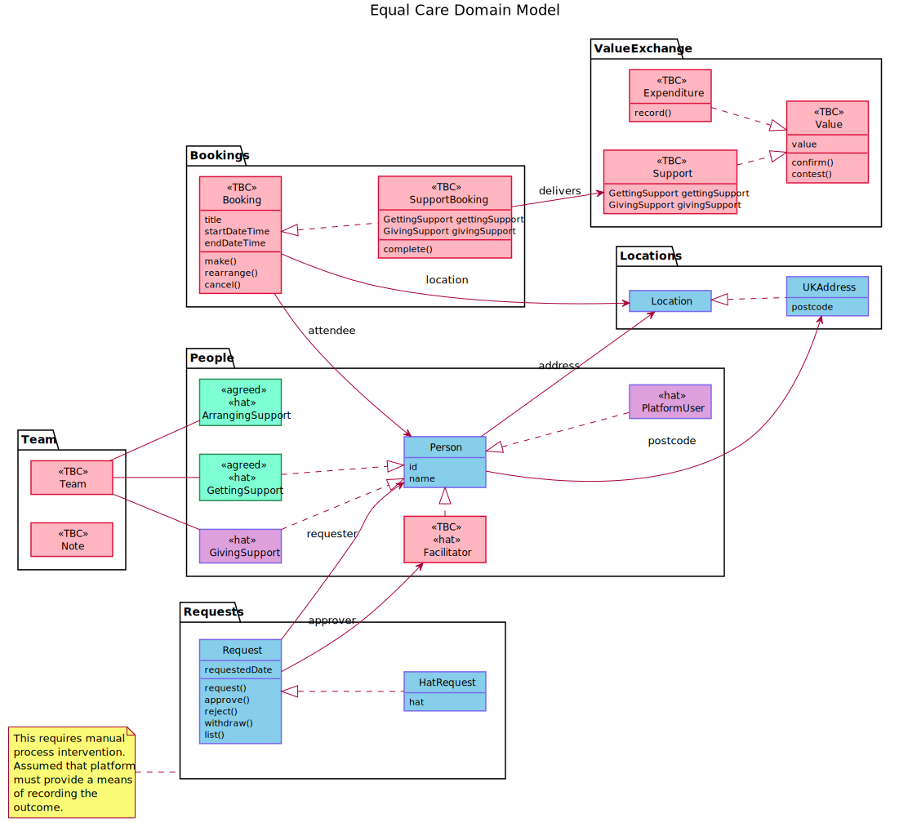

# domain model

This model defines the concepts and terminology which will be used as we design and build the Equal Care platform.

It is important that we get this terminology correct as it will form the common language between the users and developers of the platform.


Please provide feedback and edits on the terms I am using. Many of these are not yet tested or implemented!


The diagram below shows an overview of the schema which should cover MVP. This is subject to detailed UX and technical design work.

Please note, the items in a red colour are not yet fully agreed. Those items in a green colour are agreed, but not yet implemented. The items in a blue colour are implemented. Hats are, naturally, purple.

## Descriptions

### People

#### Person

The core of the model is a representation of a person who is then expressed in a series of different ways by the Hats that they wear. These _Hats_ can be seen in the model as they link directly to the 'abstract' Person interface with a dotted line and an open arrowhead.

#### Platform User

The user is the first 'hat' for every person registered in the system. This enables the creation of the core of the profile, and will be assigned when any user registers.

#### \(Person\) Giving Support

This hat is applied to people who are giving support in the system, regardless of whether this is paid or unpaid care and support. This may be resolved by a separate label which segregates these two whilst enabling one person to do both \(for example, giving care for a family member and also offering paid care and support to others\).

People: Giving: Paid or People: Giving: Unpaid.

#### \(Person\) Receiving Support

This hat is worn by people who are getting support within the platform. 

#### \(Person\) Arranging Support

This hat represents people who are responsible for arranging care on behalf of a person receiving support. They can be said to represent that person and to work in their interests. This role is extremely variable, ranging from an oversight and information access through to active management of the bookings, introductions and reviews. It is best represented by the [Team Co-ordinator](https://app.gitbook.com/@eccoo/s/policies/safe-and-well/roles-and-responsibilities/the-team/team-co-ordinator) role description. 

Note the person arranging may also be giving care and support to the person receiving and the person receiving may also be arranging their own care and support and giving or arranging support for others.

#### Facilitator

The Equal Care Facilitator is a critical part of the overall support model. There are certain things that only a facilitator can do.

### Bookings

#### Booking

A booking is ATTENDED\_BY two or more Users. They OCCUR\_AT a location. They may result in Expenses to be paid to a Platform User and may enable value exchange from a Person Giving to a Person Receiving and vice versa.

### Locations

#### Location

A location represents a physical or a virtual address \(WhatsApp group, phone call, zoom link etc\) and will be modelled with the appropriate attributes.

#### UKAddress

The platform will initially be developed for the UK, and many parts of the user experience are being designed with UK addresses in mind \(e.g. Postcode check\). This is a concrete specialisation of Location to address this specific concept.

### ValueExchange

This is a grouping of value that is exchanged using the platform.

### Value

This is an abstract concept that tracks the journey of value across the platform. Value has a lifecycle: it is registered, approved or queried, and ultimately 

#### Support

This is a recognition that the main thing to flow from an Booking is that some value is exchanged in terms of support or care given and transactions made. This will need to be captured somehow.

#### Expenditure

This is the representation of an out of pocket expense to be paid back to a user. In most cases, this will be to a Person Giving Support.

## Other concepts to explore

The following concepts are likely to be needed, but are as yet ill defined.

* Contact Details
* Notes, shared with the person getting support's Team
* Profile information for both person giving support and person getting support
* Review of how the booking went
* Messages to other people in the person's Team

## References

We have selected a set of technologies which enable us to map these concepts into the implementation very closely.

* GraphQL for the API between the backend services and frontend \(UI in the first instance\)
* A graph database \(Neo4j\) as the primary storage of the relationships managed within the system.


It might help you to review these web pages once you have read this page. I've listed them in approximately increasing order of complexity.

* [https://graphql.org/learn/](https://graphql.org/learn/)
* [https://graphql.org/learn/thinking-in-graphs/](https://graphql.org/learn/thinking-in-graphs/)
* [https://neo4j.com/blog/why-graph-databases-are-the-future/](https://neo4j.com/blog/why-graph-databases-are-the-future/)
* [https://neo4j.com/developer/guide-data-modeling/](https://neo4j.com/developer/guide-data-modeling/)
* [https://neo4j.com/blog/data-modeling-basics/](https://neo4j.com/blog/data-modeling-basics/)


