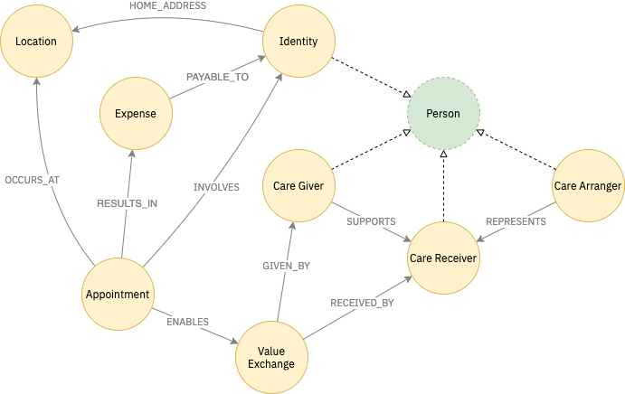

# graph schema

We use a graph database to represent the relationships managed within the system.

It is important that we get this terminology correct as it will form the common language between the users and developers of the platform.


Please provide feedback and edits on the terms I am using. None of these are yet tested or implemented!


The diagram below shows an overview of the schema which should cover MVP. This is subject to detailed UX and technical design work.

## Descriptions

### Person

Core to the model is that it models people who are interacting using the platform. All people are modeled as the same type. Their access to features of the system are defined by the Hats they wear \(WEARS\_HAT\) relationship.

People will have a HOME\_ADDRESS location, and potentially other locations.

### Hat

Hats define the roles that people take within the system.

There will be strict controls over who can add and remove hats, based on hats they themselves wear.

### Appointment

Appointments INVOLVE two or more people. They OCCUR\_AT a location.

### Location

A location represents a physical address, and will be modelled with the appropriate attributes.

### Value Exchange

This may not actually form part of the graph - but it is a recognition that the main thing to flow from an appointment is that some value is exchanged in terms of support or care given. This will need to be captured somehow.

## Other concepts to explore

The following concepts are likely to be needed, but are as yet ill defined.

### Contact Details

