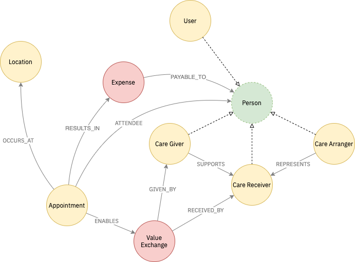

# graph schema


It might help you to review these web pages before reading this page. I've listed them in approximately increasing order of complexity.

* [https://graphql.org/learn/](https://graphql.org/learn/)
* [https://graphql.org/learn/thinking-in-graphs/](https://graphql.org/learn/thinking-in-graphs/)
* [https://neo4j.com/blog/why-graph-databases-are-the-future/](https://neo4j.com/blog/why-graph-databases-are-the-future/)
* [https://neo4j.com/developer/guide-data-modeling/](https://neo4j.com/developer/guide-data-modeling/)
* [https://neo4j.com/blog/data-modeling-basics/](https://neo4j.com/blog/data-modeling-basics/)


We use a graph database to represent the relationships managed within the system.

It is important that we get this terminology correct as it will form the common language between the users and developers of the platform.


Please provide feedback and edits on the terms I am using. None of these are yet tested or implemented!


The diagram below shows an overview of the schema which should cover MVP. This is subject to detailed UX and technical design work.

Please note, the items in a red colour \(namely Value Exchange and Expense\) are not yet implemented.

## Descriptions

### Person

The core of the model is a representation of a person who is then expressed in a series of different ways by the Hats that they wear. These _Hats_ can be seen in the model as they link directly to the 'abstract' Person interface with a dotted line and an open arrowhead.

### User

The user is the first 'hat' for every person registered in the system. This enables the creation of the core of the profile, and will be assigned when any user registers.

### Care Giver

This hat is applied to people who provide care in the system. There is some discussion about paid vs unpaid Care Givers. This may be resolved by a separate label which segregates these two.

Care Givers support Care Receivers.

### Care Receivers

This hat is worn by people who receive care within the system. 

### Care Arrangers

This hat represents people who are responsible for arranging care for a Care Receiver. They can be said to represent a Care Receiver.

### Appointment

Appointments are ATTENDED\_BY two or more Users. They OCCUR\_AT a location. They may result in Expenses to be paid to a Platform User and may enable value exchange from a Care Giver to a Care Receiver.

### Location

A location represents a physical address, and will be modelled with the appropriate attributes.

### Value Exchange

This may not actually form part of the graph - but it is a recognition that the main thing to flow from an appointment is that some value is exchanged in terms of support or care given. This will need to be captured somehow.

### Expense

This is the representation of an out of pocket expense to be paid back to a user. In most cases, this will be a CareGiver.

## Other concepts to explore

The following concepts are likely to be needed, but are as yet ill defined.

* Contact Details
* Notes

