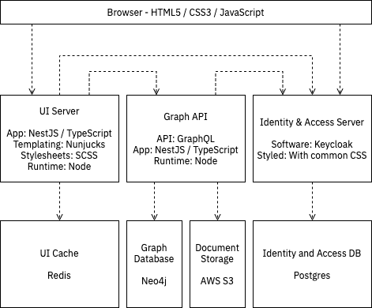

# software stack

The software stack is outlined below

## Tiers

### Client

We have decided to use a server-side rendered HTML page as this provides for a simpler means of managing accessibility. We will use minimal client-side javascript, mainly for form validation, and in exceptional circumstances for augmented animations.

## Server

The server tier comprises \(for the moment...\) the UI server, the Graph API and the Identity and Access Server.

The UI Server and Graph API comprise a similar software stack, both being based on TypeScript compiled to JavaScript running on Node. We are using the NestJS framework to encourage modular server builds.

### Data

There are a number of data stores:

* The UI Session cache uses Redis in memory store
* The Graph API primarily stores data in Neo4j, with any large objects \(such as documents and images\) being stored in AWS S3 Object store.
* The Identity and Access server uses a Postgres database for persistence.

