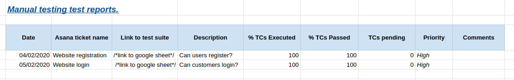
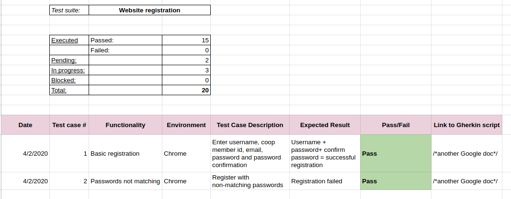

# reports from manual tests

Test reports will be recorded using Google docs and will be available for anyone who wishes to know the progress or quality of a particular ticket that has gone through manual testing.

### Test reports per Asana ticket/test suite

In most situations a one test suite will be created per Asana ticket.  Therefore each entry on the test report summary Google Sheet will represent an Asana ticket. On this spreadsheet you will be able to get a general overview of the status and quality of each test suite e.g.: % of Test cases executed, % of test cases passed and how many test cases are pending. If you would like more detailed information about the testing executed on a particular test suite/Asana ticket then you can follow the relevant link.

### Test reports per test case within a test suite

Each test suite will have a spreadsheet similar to the one below whereby you can see the details of every individual test conducted as well as an overview of the status for that test suite. If you would like more information you can follow the link in the end column, which will take you to the Gherkin script for that test case.

